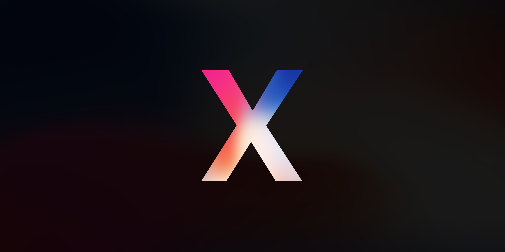

<!--  -->
# The iPhone X
...one day later

I have had the iPhone for one day now, so treat this less like a review and more like a *first impressions*.

### Moving from Android
The process of moving from my Pixel 2 XL was surprisingly smooth. I used the [Move to iOS app](https://play.google.com/store/apps/details?id=com.apple.movetoios&hl=en) and it moved over all of my contacts, messages, and even some of my apps. I then installed the whole google sweet of apps (most of which where not optimized yet 😦). Everything worked like a charm, all my data was exactly where I had left it on my Android phone. The best part of all was that the whole process only took about half an hour. I then spent the rest of the night downloading new apps, and logging into them. Another difference between iOS and Android that I noticed is that 1Password works *so* much better. This made logging into my apps pretty easy.

### My Favorite Apps
Another difference that I noticed right off the bat is that in general, *iOS apps are just better than Android apps*. At first when people would say that Android apps were bad or anti-intuitive, I would not believe them. But now I see what they are saying! I even feel like some of the google apps work better on my iPhone.

I have been enjoying a lot of the third party apps especially overcast which is a **huge** step up from my previous podcast app [Podcast Addict](https://play.google.com/store/apps/details?id=com.bambuna.podcastaddict&hl=en).

### iMessage
iMessage is amazing. It is a huge step up from Android messenger. I love all the extra features, like knowing when messages are delivered and read. I also like all the in-message apps like 8 Ball and Cup Pong. Stickers, GIFs, and animoji are also lots of fun (though I have not found myself using animoji as much as I thought I would).

### What I *Love*
The top of my list for best things about this phone is defiantly the build quality. It is like no Android phone period. Not even the Galaxy S8, which I would *think* should have a similar build quality. The extra 5mm on either side of the display actually make it look *a lot* better than the pixel, and so far the battery life has been just fine.

Next I would say that the OS is very smooth. I do have some problems with the it, but I will talk about those next. I like the gestures (especially the previous app gesture) and everything feels like it has a place and works. I have only found one thing that seemed slightly broken (magnification) and I think this was due to user error and not the OS.

3D touch is also great. I like how you can press things harder to dig deeper into their settings, or get shortcuts.

Lastly, this phone feels lightning fast. It never freezes or randomly quits apps. It had no problem installing lots of apps very quickly, or moving 9GB worth of photos. Another great feature that I have taken advantage of is that iOS closes background apps without you having to do anything.

### What I wish they would change
- Defaults. I wish I could set default apps like chrome as my default web browser (even though it would still have to use webkit) or Inbox as my default mail app.

- Notifications. I really loved the way Android handles notifications, I wish iOS did something similar. I would also like my notifications to appear under control center, so I could just keep scrolling and see them.

- Always on Display. I really liked my Pixel's always on display. Especially with these new AMOLED displays, I think this would be a great feature.

- Back Button. I find myself constantly trying to use the swipe to most recent app gesture when trying to go back to the previous window of an app. I think it would be cool if they incorporated this as a feature.

- Launcher. Even though multi touch allows you to move multiple apps across your home screen at once, I still find it very hard to organize my home screen. I also liked how the Pixel Launcher allowed you to have white space and widgets (though I do not mind only having widgets on the far left window of the home/lock screen). But the thing I miss most about the Pixel Launcher is only having about a dozen apps out on my home screen and the rest in a drawer alphabetically organized with the five most commonly used at the top.

- Written & Published: *November 13 2017*

***

